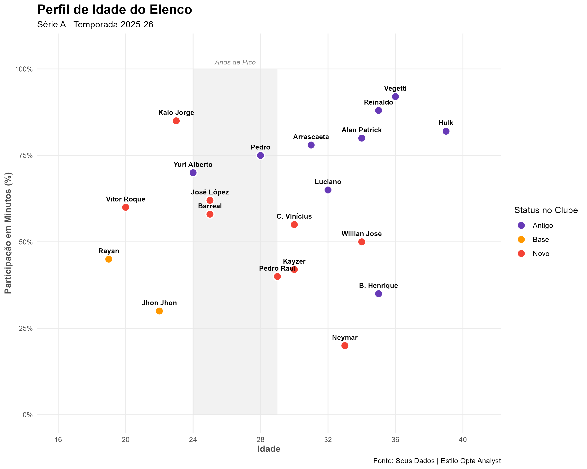
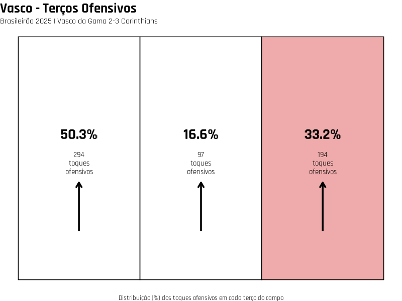
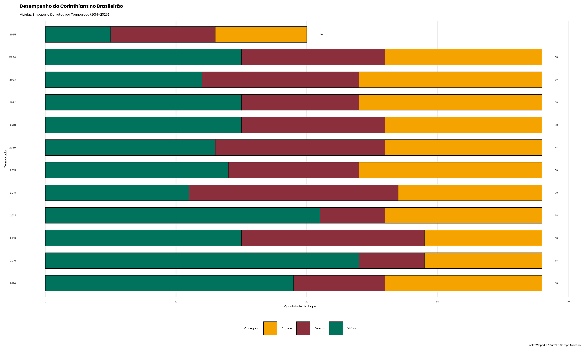

# ⚽ Portfólio de Análise de Dados: Campo Analítico

Este repositório reúne visualizações avançadas de dados de futebol, utilizando **R**, focadas em scouting, desempenho individual e métricas coletivas.

---

# 📊 Projeção de Gols & Perfil de Idade (Série A 2026)

Esta seção apresenta uma análise de desempenho dos artilheiros e a maturidade do elenco na temporada atual.

### 🏆 Tabela de Artilharia e xG
Tabela estilizada inspirada no *The Athletic*, dividida em colunas para facilitar a leitura dos principais nomes da competição.

### 📈 Perfil de Idade do Elenco
Gráfico de dispersão mostrando a relação entre idade e minutos jogados, com destaque para a "Zona de Pico" (Peak Years).

---

# 🛡️ xG Brasileirão - Top Scorers por Clube

Visualização criada em **R** usando `ggplot2`, `dplyr` e `showtext`.
O gráfico mostra o **xG acumulado por clube** e o **principal artilheiro** de cada equipe na Série A.

---

# ⚔️ Top Defensive Actions — Paulo Henrique (Série A 2025)

O gráfico mostra as **10 partidas** em que o lateral **Paulo Henrique** registrou o maior número de **Tackles + Interceptions (Tkl+Int)**.

---

# 🎯 Attacker Profiling (Polar Chart)

Visualização polar que mapeia a distância e o resultado de finalizações entre 2010–2019.
As temporadas são posicionadas como **números de um relógio**.

Cores: 🔵 Gols | 🟡 Defesas | 🔴 Erros  

---

# 👤 Perfil de Mohamed Salah - Estilo SmarterScout

Radar de métricas avançadas comparando posse, ataque e defesa, com inserção de imagem via `magick`.

---

# 💢 Vasco da Gama – Terços Ofensivos

Análise visual da distribuição dos **toques ofensivos** do Vasco por região do campo (esquerda, centro e direita) no estilo **Opta Analyst**.

---

# 🏆 Desempenho do Corinthians (2014–2025)

Gráfico de barras empilhadas mostrando o histórico de vitórias, empates e derrotas do clube na era dos pontos corridos recente.

---

## 💻 Tecnologias utilizadas

- **Linguagem:** R
- **Bibliotecas:** `tidyverse`, `ggplot2`, `gt`, `ggsoccer`, `showtext`, `magick`, `cowplot`.
- **Estilo:** Inspirado em Opta Analyst, The Athletic e SmarterScout.

---

## 🏷️ Autor

**Campo Analítico** 📊 Consultoria e educação em análise de dados aplicada ao futebol.  
📧 [contatocampoanalitico@gmail.com](mailto:contatocampoanalitico@gmail.com)  
🌐 [@campoanaliticoestudos](https://github.com/campoanaliticoestudos)
