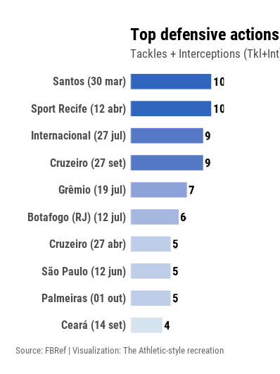
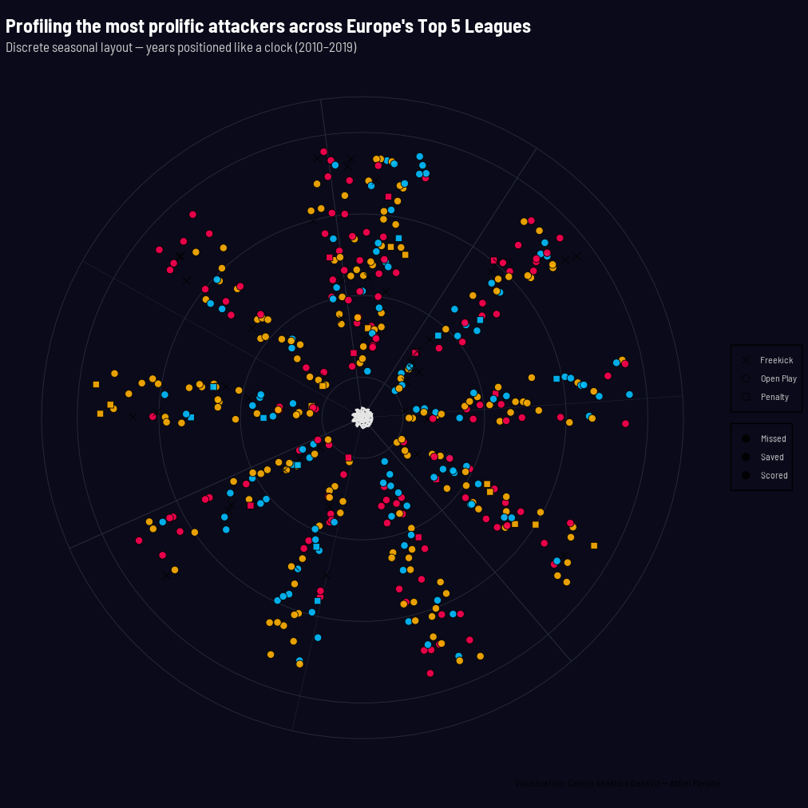
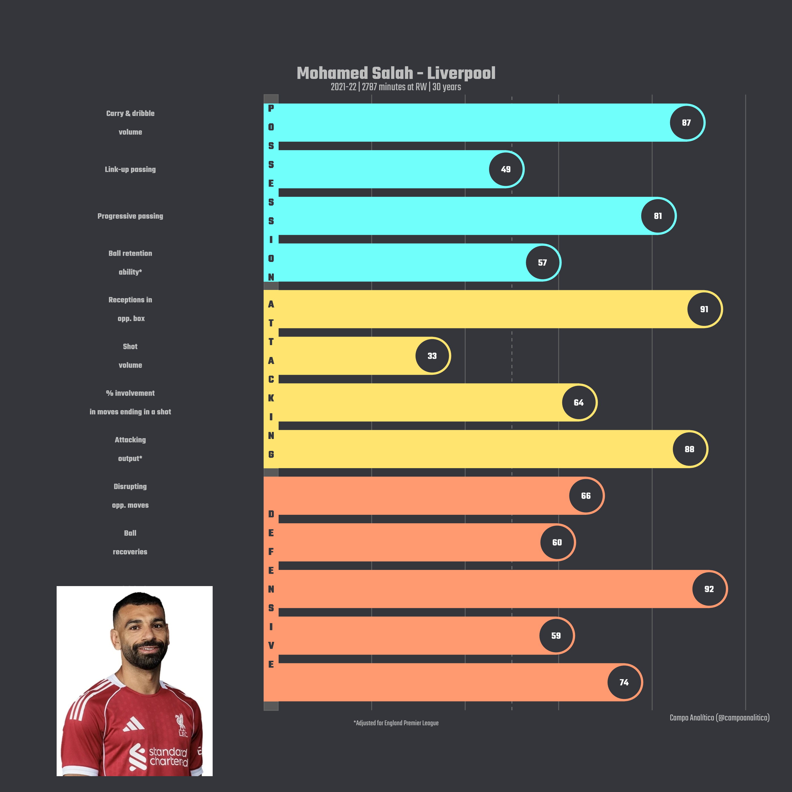

# xg_brasileirao

# 📊 Expected Goals (xG) - Brasileirão Série A

Visualização criada em **R** usando `ggplot2`, `dplyr` e `showtext`.

O gráfico mostra o **xG acumulado por clube** e o **principal artilheiro** de cada equipe na Série A.


---

## 🧾 Código utilizado
O script completo está disponível em [`xg_brasileirao_topscorer.R`](xg_brasileirao_topscorer.R).

Principais pontos:
- **Fonte Montserrat** importada via `showtext`.
- **Destaque visual** para o clube “Mirassol”.
- **Eixo horizontal** com `coord_flip()`.
- **Exportação automática** do gráfico com `ggsave()`.

---

# 🛡️ Top Defensive Actions — Paulo Henrique (Série A 2025)

Visualização criada em **R** usando `ggplot2`, `dplyr` e `showtext`.

O gráfico mostra as **10 partidas** em que **Paulo Henrique** registrou o maior número de **Tackles + Interceptions (Tkl+Int)** durante a temporada 2025.



---

## 🧾 Código utilizado
O script completo está disponível em [`paulo_henrique_defensive_actions.R`](paulo_henrique_defensive_actions.R).

Principais pontos:
- Leitura do dataset via `read_csv()`.
- Seleção e formatação das variáveis de interesse (`Opponent`, `Date`, `Tkl+Int`).
- Destaque para as **10 partidas de maior desempenho defensivo**.
- Gradiente de cor azul representando intensidade de ações defensivas.

---

### 💡 Reproduzindo o gráfico
1. Baixe o arquivo CSV original do FBRef e ajuste o caminho do arquivo no script.
2. Instale os pacotes necessários:
   ```r

---

# 🎯 Attacker Profiling (2010–2019)

Visualização polar inspirada em layouts editoriais de dados, como *The Athletic* e *Opta Analyst*.

Cada ponto representa um **chute** de jogadores em uma das temporadas de 2010 a 2019.  
As temporadas são posicionadas como **números de um relógio**, e as distâncias representam a **distância do chute**.

Cores:
- 🔵 **Scored** – Gols marcados  
- 🟡 **Saved** – Finalizações defendidas  
- 🔴 **Missed** – Finalizações erradas  

Formas:
- ⚪ **Open Play** – Jogadas normais  
- 🔷 **Freekick** – Faltas  
- 🟥 **Penalty** – Pênaltis  



---

## 🧾 Código utilizado
O script completo está em [`attacker_profiling_polar.R`](attacker_profiling_polar.R).

---

### 💡 Reproduzindo o gráfico
1. Instale os pacotes necessários:
   ```r
   install.packages(c("ggplot2", "dplyr", "showtext"))

   install.packages(c("ggplot2", "dplyr", "showtext", "ggtext", "readr"))
---

### 3. Perfil de Mohamed Salah - estilo SmarterScout


- Radar de métricas de **posse, ataque e defesa**  
- Inserção da imagem do jogador usando `magick` + `cowplot`  
- Dados simulados, mas estrutura pronta para importar CSV real

**Script:** [`03_smarter_profile_salah.R`](03_smarter_profile_salah.R)

---

# ⚽ Vasco da Gama – Terços Ofensivos (Brasileirão 2025)

Análise visual da distribuição dos **toques ofensivos** do Vasco da Gama na partida **Vasco 2–3 Corinthians**, válida pelo Brasileirão 2025.

---

## 📊 Objetivo

Este projeto tem como objetivo mostrar, em formato gráfico, **como os toques ofensivos se distribuem em cada terço do campo** — esquerda, centro e direita — no estilo visual da **Opta Analyst**.

---

## 🧠 Metodologia

1. **Leitura dos dados de evento** da partida.
2. **Filtragem** de ações ofensivas (passes, chutes, dribles, gols e toques).
3. **Classificação** das ações por região do campo (`x` em 0–100 → esquerda, centro, direita).
4. **Visualização** dos percentuais e volumes por terço.

---

## 🧩 Estrutura do repositório

